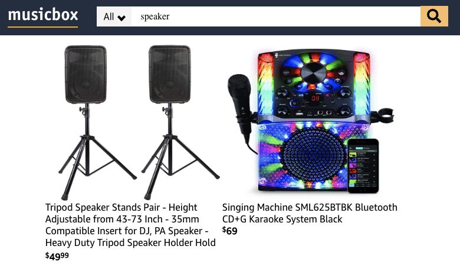
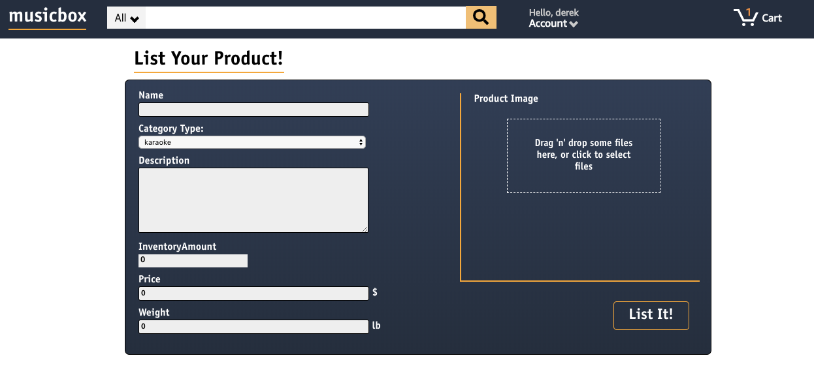

# Music Box

[MusicBox](https://musicbox-aa.herokuapp.com/#/search/all "Live Demo") is an Amazon themed music store where customers can purchase music equipment. Users can search for products in the database, add items to their cart, and they can also list products to be sold.

## Technology Stack
* GraphQL
* Javascript
* React
* Apollo
* Node
* MongoDB
* AWS
* Docker

## Search



Users are able to search for any products in the database relating to the search term entered into the search bar. Product names are truncated so that they don't overflow, and each image is given a uniform height and width so that they stack nicely into rows and columns when more products are returned from the search query.

When the search term is entered, a query is made for any product with that term in the product name or description. That info is packed into an object that includes a photo, price, name, description, and display URL so that it can be rendered onto a search index of all matching products. A backend query code snippet is shown below.

```
productByNameOrDescription: {
    type: new GraphQLList(ProductType),
    args: { searchText: { type: GraphQLString }},
    resolve(_, { searchText }){
    return Product.find({ $text: { $search: searchText } }).populate("category").then(products => products).catch(e => console.log(e));
    }
}
```

## Product Upload



In addition to being able to search for and purchase products in the database, users are also able to upload their own products. Upon submitting all of the product information, the product is packaged into a Mongoose model that is stored in a MongoDB database, and the associated picture is stored in an AWS S3 bucket. The code snippet below shows an asynchronous Javascript function calling a backend mutation to upload a photo to the S3 bucket and set its URL.

```
const uploadFile = async () => {
    const response = await s3Sign({ 
        variables: {
            filename: photo.name,
            filetype: photo.type
        } 
    })

    const { signedRequest, url } = response.data.signS3;
    setAwsUrl(url);
    await uploadToS3(photo, signedRequest);
    return setState();
}
```